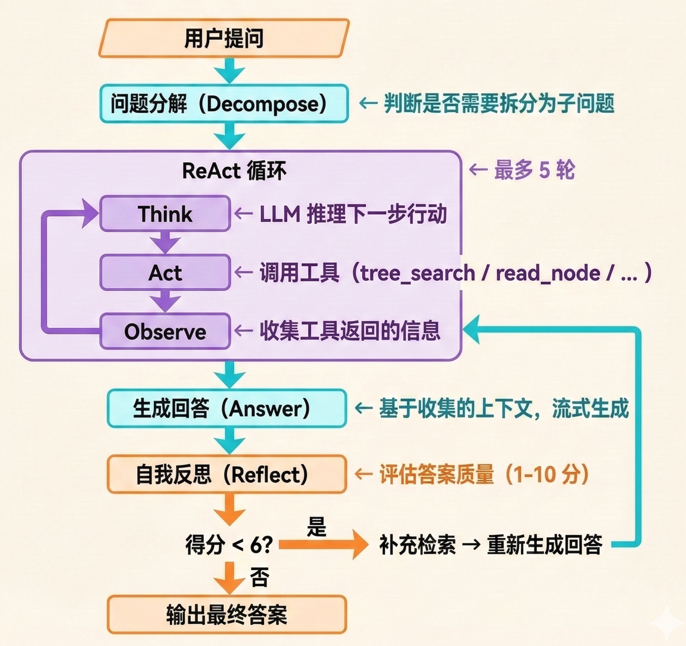

🤖 PageIndex Chat UI

> **Agentic RAG Document Q&A System Based on Tree-Structure Reasoning**
> No Vectors, No Embeddings — Let LLM Read Documents Like Humans Do

<p align="center">
  <a href="#-project-overview">Overview</a> •
  <a href="#-core-features">Features</a> •
  <a href="#-quick-start">Quick Start</a> •
  <a href="#-technical-architecture">Architecture</a> •
  <a href="#-api--model-information">API/Models</a> •
  <a href="#-cost-estimation">Cost</a> •
  <a href="#-acknowledgments">Acknowledgments</a>
</p>

---

## 📖 Project Overview

**PageIndex Chat UI** is an intelligent Q&A system designed for PDF documents. It is built upon the core indexing algorithm of the open-source project PageIndex, with a complete **Agentic RAG** interaction interface layered on top.


### 💡 Core Philosophy: Similarity ≠ Relevance

Traditional RAG systems rely on vector embeddings for retrieval — semantically similar passages are not necessarily the context needed to answer a question. PageIndex adopts a completely different approach:
* **When building the index**: Parse the PDF into a hierarchical tree structure (similar to a book's table of contents), and generate summaries for each node.
* **When answering questions**: Let the LLM perform reasoning-based navigation on the tree structure, progressively locating the chapter/paragraph containing the answer.

*No embeddings, no vector database — retrieval is accomplished entirely through the LLM's reasoning capabilities.*

---

## ✨ Core Features

### 🧠 Agent System (Five Capabilities)
The Q&A engine of this project is not a simple "retrieve → generate" pipeline, but an Agent with a complete reasoning chain:

| Capability | Description |
| :--: | :--: |
| **ReAct Loop** | Think → Act → Observe iterative reasoning, up to 5 rounds |
| **Multi-Tool Scheduling** | 5 built-in tools; the Agent autonomously chooses which tool to use at each step |
| **Question Decomposition** | Complex questions are automatically split into sub-questions, retrieved separately, then synthesized |
| **Self-Reflection** | After generating an answer, automatically evaluates quality; if below threshold, performs additional retrieval and re-answers |
| **Proactive Analysis** | After document indexing is complete, automatically generates summaries, key findings, and recommended questions |

### 🛠️ Built-in Tools
The Agent can call the following tools during each ReAct loop:

| Tool Name | Function Description |
| :--: | :--: |
| `tree_search` | Perform reasoning-based search on the document tree structure to locate relevant chapters |
| `read_node` | Read the full text content of a specified node |
| `keyword_search`| Perform exact keyword/phrase matching across the full text |
| `view_pages` | View page images (in visual mode, charts/formulas/tables are analyzed via VLM) |
| `summarize_nodes`| Generate LLM summaries of node content for information compression |

### 🌗 Dual-Mode RAG

| Mode | Description | Use Case |
| :--: | :--: | :--: |
| **Text Mode** | Uses node text as context, calls text model | Documents dominated by text |
| **Visual Mode** | Uses page images as context, calls multimodal model | Documents rich in charts, formulas, and tables |

### 🧩 Custom Skills
Define the Agent's specialized skills via Markdown files, extending Agent behavior without modifying code. Includes 4 built-in example skills:
* **Formula Interpretation**: Explains the meaning of mathematical symbols and derivation logic
* **Key Information Extraction**: Extracts core contributions, methods, and experimental results from papers
* **Paper Comparative Analysis**: Systematically compares different methods/models in the document
* **Table Data Extraction**: Locates and extracts table data, outputting as Markdown tables

### 🌟 Other Highlights
* **Streaming Output**: Answers and reasoning processes are displayed in real-time streaming
* **Multi-turn Conversation Memory**: Retains the last 5 rounds of conversation history as context
* **Answer Traceability**: Each answer cites the referenced node ID and page number, with direct jump-to-view capability
* **Page Highlighting**: Highlights the source nodes of corresponding text blocks on PDF page images
* **Web UI Online Configuration**: Models, API Keys, and Base URLs can all be dynamically modified in the interface

---

## 🚀 Quick Start

### Environment Requirements
* Python >= 3.11
* OpenAI API Key (or any service compatible with the OpenAI API format)

### Installation

```bash
# Using pip
pip install -r requirements.txt

# Or using uv (recommended, faster)
uv sync
```

### Startup

```bash
# Option 1: Run directly
python app.py

# Option 2: Using uv
uv run python app.py

# Option 3: Using startup script (Linux/macOS)
./start.sh
```

The service runs by default at **http://localhost:5001**

### ⚙️ First-Time Configuration

After startup, open your browser to `http://localhost:5001`, click the settings icon in the top-left corner of the interface, and configure:

1. **Text Model**: Enter the model name, API Key, and Base URL
2. **Vision Model** (optional): If you need to use visual mode, enter the multimodal model configuration

Configuration is saved to `config.json`

---

## 🏗️ Technical Architecture

### 🗺️ System Architecture Diagram


### 🔄 Agent Workflow



### 📁 Project Directory Structure

```
PageIndex_Agent_UI/
├── app.py                  # Flask application initialization, route registration
├── main.py                 # Main entry point (reads config and starts)
├── config.py               # Configuration management (singleton ConfigManager)
├── config.json             # Runtime configuration (gitignored, contains API Keys)
├── requirements.txt        # Python dependencies
├── pyproject.toml          # Project metadata & dependencies (uv compatible)
├── start.sh                # Startup script
│
├── pageindex/              # PageIndex core indexing engine
│   ├── page_index.py       #   Tree structure construction: TOC detection → page alignment → recursive splitting
│   ├── utils.py            #   PDF parsing, Token calculation, LLM call wrappers
│   └── config.yaml         #   Default indexing parameters
│
├── services/               # Business logic layer
│   ├── agent.py            #   DocumentAgent: ReAct / Decomposition / Reflection / Analysis
│   ├── rag_service.py      #   RAG service + PageIndex wrapper (LLM/VLM calls)
│   ├── indexing_service.py #   PDF indexing scheduler
│   ├── skill_manager.py    #   Skill file loading and management
│   └── tools/              #   5 tools callable by the Agent
│       ├── base.py         #     BaseTool + ToolRegistry
│       ├── tree_search.py  #     Tree search tool
│       ├── node_reader.py  #     Node reading tool
│       ├── keyword_search.py#    Keyword search tool
│       ├── page_viewer.py  #     Page viewing tool (VLM)
│       └── summarizer.py   #     Summarization tool
│
├── skills/                 # Custom skills (Markdown format)
│   ├── formula_explainer.md
│   ├── key_info_extraction.md
│   ├── paper_comparison.md
│   └── table_extraction.md
│
├── models/                 # Data models
│   └── document.py         #   Document / Message / DocumentStore
│
├── routes/                 # Routes & Communication
│   ├── api.py              #   REST API (file upload, configuration, skill management)
│   └── socket_handlers.py  #   WebSocket handling (chat, indexing progress)
│
├── templates/
│   └── index.html          # Frontend page (single-file SPA)
├── static/
│   └── js/app.js           # Frontend logic
│
├── uploads/                # PDF upload storage (gitignored)
└── results/                # Index result storage (gitignored)
```

---

## 🔌 API / Model Information

### Invocation Method

This project calls LLMs via the **OpenAI Python SDK** (`openai` >= 1.0), supporting both synchronous and asynchronous methods:

| Scenario | Invocation Method | Description |
|------|----------|------|
| Index Building (PageIndex Core) | `openai.OpenAI` synchronous calls | `ChatGPT_API` series of functions in `pageindex/utils.py` |
| Q&A Reasoning (Agent / RAG) | `openai.AsyncOpenAI` asynchronous calls | `call_llm` / `call_vlm` in `services/rag_service.py` |

All calls configure the API endpoint via the `base_url` parameter, so **any service compatible with the OpenAI Chat Completions API format can be used** (such as third-party proxies, locally deployed models, etc.).

### Models Involved

This project **does not use embedding models or vector databases**. All capabilities rely solely on the Chat Completion API.

| Purpose | Configuration Location | Default Model | Description |
|------|----------|----------|------|
| **Index Building** | `pageindex/config.yaml` or Web UI text model | `gpt-4o-2024-11-20` | Used for TOC detection, structure parsing, page alignment, and summary generation. Index quality requires strong reasoning capabilities from this model |
| **Q&A - Text Mode** | Web UI → Text Model | `gpt-4o-mini` | Agent reasoning, tree search, answer generation, self-reflection. Recommends cost-effective models |
| **Q&A - Visual Mode** | Web UI → Vision Model | `gpt-4.1` | Requires multimodal capabilities (accepts image input), used for visual analysis of charts/formulas/tables |

> The default models above are only recommended configurations; you can freely change to any OpenAI-compatible model in the Web UI settings panel.
> During the testing phase, both text and vision models used were 'gpt-5-mini'.

### ⚙️ Configuration Parameters

#### Model Configuration (`config.json` / Web UI)

| Parameter | Description |
|------|------|
| `models.text.name` | Text model name (e.g., `gpt-4o-mini`) |
| `models.text.api_key` | Text model API Key |
| `models.text.base_url` | Text model API endpoint (e.g., `https://api.openai.com/v1`) |
| `models.vision.name` | Vision model name (e.g., `gpt-4.1`) |
| `models.vision.api_key` | Vision model API Key |
| `models.vision.base_url` | Vision model API endpoint |

#### Indexing Parameters (`pageindex/config.yaml`)

| Parameter | Default Value | Description |
|------|--------|------|
| `model` | `gpt-4o-2024-11-20` | Model used for index building |
| `toc_check_page_num` | `20` | Scan the first N pages to detect TOC |
| `max_page_num_each_node` | `10` | Maximum pages per node; exceeds triggers recursive splitting |
| `max_token_num_each_node` | `20000` | Maximum tokens per node; exceeds triggers recursive splitting |
| `if_add_node_id` | `yes` | Whether to assign IDs to nodes |
| `if_add_node_summary` | `yes` | Whether to generate node summaries |
| `if_add_doc_description` | `no` | Whether to generate full document description |
| `if_add_node_text` | `no` | Whether to retain original node text in the structure |

#### Agent Parameters (constants in `services/agent.py`)

| Parameter | Value | Description |
|------|-----|------|
| `MAX_REACT_STEPS` | `5` | Maximum ReAct rounds per sub-question |
| `MAX_RETRY` | `1` | Maximum retries after reflection fails |
| `REFLECT_ACCEPT_THRESHOLD` | `6` | Retries are triggered when reflection score is below this (out of 10) |

---

## 💰 Cost Estimation

Since this project is driven entirely by LLM APIs, usage costs depend on the pricing of the selected models. The following estimates are based on official OpenAI pricing (2025) and are for reference only.

> In practice, as long as high-cost models like `GPT-5.2 Pro` are not used, the API expenses for this project are entirely acceptable.

### Indexing Phase (One-time, per document)

The indexing process involves extensive LLM calls: TOC detection, structure parsing, page alignment & verification, node summary generation, etc.

| Document Size | Estimated LLM Calls | Using gpt-4o-mini | Using gpt-4o | Using gpt-5-mini |
|----------|-------------------|-----------------|-------------|-------------|
| Short doc (~10 pages) | 30–60 calls | $0.01–0.04 | $0.20–0.60 | $0.03–0.10 |
| Paper (~20 pages) | 50–100 calls | $0.02–0.08 | $0.40–1.20 | $0.05–0.20 |
| Long doc (~100 pages) | 150–400 calls | $0.08–0.30 | $1.50–5.00 | $0.20–0.80 |

> **Note**: The number of calls during indexing is strongly correlated with document structure complexity. Documents with clear TOCs require fewer calls; documents without TOCs need to build the structure from scratch, requiring more calls.

### Q&A Phase (per question)

Each question undergoes: Question decomposition (1 call) → ReAct loop (3–10 calls) → Answer generation (1 call) → Reflection (1 call), possibly with retries.

| Scenario | Estimated LLM Calls | Using gpt-4o-mini | Using gpt-4o / gpt-4.1 | Using gpt-5-mini |
|------|-------------------|-----------------|----------------------|-------------|
| Simple question (single-step retrieval) | 4–6 calls | $0.003–0.008 | $0.05–0.10 | $0.008–0.02 |
| Regular question (multi-step reasoning) | 6–12 calls | $0.005–0.015 | $0.08–0.20 | $0.015–0.04 |
| Complex question (decomposition + retry) | 12–20 calls | $0.01–0.03 | $0.15–0.40 | $0.03–0.09 |
| Visual mode (with image input) | 6–15 calls | — | $0.10–0.50 | $0.01–0.05 |

> **Note**: Visual mode consumes significantly more tokens than pure text mode due to transmitting page images (base64).

### Typical Usage Cost Examples

| Scenario | Model Configuration | Estimated Cost |
|------|----------|---------|
| Index a 20-page paper + ask 10 questions | Index with gpt-4o-mini, Q&A with gpt-4o-mini | ~$0.10–0.20 |
| Index a 20-page paper + ask 10 questions | Index with gpt-4o, Q&A with gpt-4o-mini | ~$0.50–1.50 |
| Index a 20-page paper + ask 10 questions | Index with gpt-5-mini, Q&A with gpt-5-mini | ~$0.20–0.60 |

### Actual Testing Reference

**Document: Attention Is All You Need**

> This document is an 11-page PDF; both text and vision modes used the model gpt-5-mini.

**Indexing cost: $0.11**

#### 1. Regular Q&A - Text Model

Q: Summarize the core content of this paper for me.

**Cost: $0.01**

#### 2. Regular Q&A - Visual Model

Q: What does Figure 1 depict? What colors were used in the drawing?

**Cost: $0.02**

#### 3. Skill - Formula Interpretation - Text Model

Q: Interpret formula (1) for me.

**Cost: $0.03**

#### 4. Skill - Key Information Extraction - Text Model

Q: How exactly does Multi-Head Attention alleviate limitations in information representation, and why is it more effective than single-head attention?

**Cost: $0.04**

#### 5. Skill - Paper Comparative Analysis - Text Model

Q: In low-resource or latency-sensitive scenarios, what are the advantages or disadvantages of Transformer compared to recurrent/convolutional models?

**Cost: $0.03**

#### 6. Skill - Table Data Extraction - Text Model

Q: Extract the content of Table 2 for me.

**Cost: $0.02**

#### 7. Skill - Table Data Extraction - Visual Model

Q: Extract the content of Table 2 for me.

**Cost: $0.03**

---

## 📦 Project Dependencies

| Dependency | Version | Purpose |
|------|------|------|
| Flask | >= 3.0 | Web framework |
| Flask-SocketIO | >= 5.3 | WebSocket real-time communication |
| Flask-CORS | >= 4.0 | Cross-origin support |
| openai | >= 1.0 | LLM / VLM API calls |
| tiktoken | >= 0.5 | Token counting |
| PyMuPDF (fitz) | >= 1.23 | PDF page rendering to images, text extraction |
| PyPDF2 | >= 3.0 | PDF text extraction |
| python-dotenv | >= 1.0 | Environment variable loading |
| PyYAML | >= 6.0 | Configuration file parsing |

---

## 🙏 Acknowledgments

The core PageIndex indexing algorithm of this project references the open-source project [VectifyAI/PageIndex](https://github.com/VectifyAI/PageIndex).

---

## 📄 License

MIT License

---

<p align="center">
  Made with care for better document understanding
</p>
